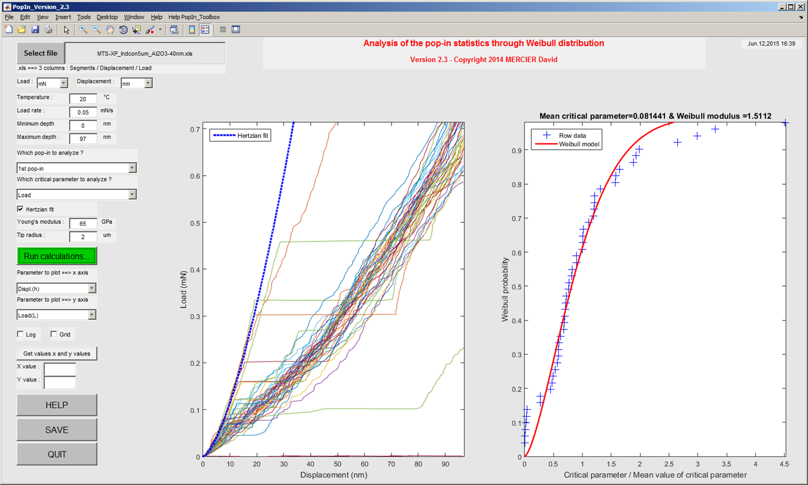

PopIn
=======
To get started with PopIn, clone the repository, then run Matlab, and cd into the folder containing this README file.
Finally you can start the launcher by typing "demo" at the Matlab command prompt.

See the full documentation at http://popin.readthedocs.org/en/latest/.

Features
----------
This Matlab toolbox has been developed to :
    * plot load-displacement curves ;
    * plot cumulative (Weibull or time/temperature dependent) distribution of the 1st or the 2nd pop-in.

Authors
---------
:Author: `David Mercier <david9684@gmail.com>`_ [1,2,3]

[1] `CEA, 17 Avenue des Martyrs, 38000 Grenoble, France <http://www.cea.fr/Pages/le-cea/les-centres-cea/grenoble.aspx>`_

[2] `Max-Planck-Institut für Eisenforschung, 40237 Düsseldorf, Germany <http://www.mpie.de/>`_

[3] `CRM Group, Avenue du Bois Saint-Jean 21, B27 – Quartier Polytech 4, 4000 Liège, Belgium <http://www.crmgroup.be/>`_

Reference papers
------------------

* `Mercier D., "Behaviour laws of materials used in electrical contacts for « flip chip » technologies" (2013). <http://www.theses.fr/2013GRENI083>`_

Acknowledgements
------------------
I acknowledge `Dr. V. Mandrillon <https://www.researchgate.net/profile/Vincent_Mandrillon>`_ from (`CEA <http://www.cea.fr/le-cea/les-centres-cea/grenoble>`_, France (Grenoble))
and to `Dr. M. Verdier <Marc.Verdier@simap.grenoble-inp.fr>`_ from (`SIMaP <http://simap.grenoble-inp.fr>`_, France (Grenoble)), for long discussions and many advices about nanoindentation.

I would like also to acknowledge Eli Billauer for the function `peakdet <https://github.com/DavidMercier/PopIn/blob/master/matlab_code/statistics/peakdet.m>`_ released to the public domain (http://www.billauer.co.il/peakdet.html).

Keywords
-----------
MATLAB ; Graphical User Interface (GUI) ; pop-in ; nanoindentation ; statistics ; Weibull ; cumulative distribution.

Screenshot
-------------

   
   *Screenshot of the PopIn toolbox.*

Links
--------
http://www.mathworks.fr/matlabcentral/fileexchange/45376--pop-in--analysis-from-indentation-tests
