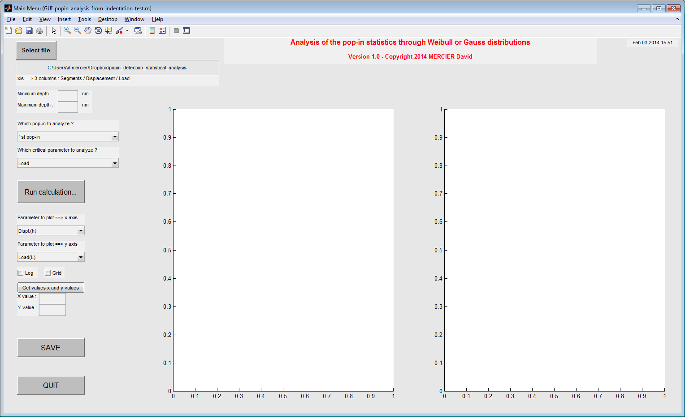
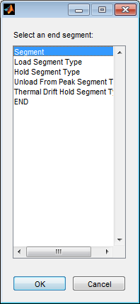

Getting started
================

.. include:: includes.rst

First of all, download the source code of the |matlab| toolbox.

`Source code is hosted at Github. <https://github.com/DavidMercier/PopIn>`_

To have more details about the use of the toolbox, please have a look to :

.. code-block:: matlab

   README.txt

How to use the GUI for "pop-in" analysis from indentation tests ?
#################################################################

* Run the following |matlab| script and answer 'y' or 'yes' to add path to the |matlab| search paths :

.. code-block:: matlab

   path_management.m
   
* Then, run the following |matlab| script :

.. code-block:: matlab

   demo.m

* The following window opens:

   
   *Screenshot of the main window of the PopIn toolbox.*

* Import your (nano)indentation results (.xls file obtained from MTS software with at least more than 20 indentation tests for statistics), by pressing the button 'Select file'.
* Select the end segment (if segments exist), in order to set the maximum indentation depth.
* It is possible to plot the stiffness (raw data) without setting the GUI for Young's modulus calculation.
* A picture of the main window as .png file is created and Weibull data are stored in a .txt file when you press the button 'SAVE'.
* Results are accessible by typing in the Matlab command window (here for 50 indentation tests) : 

.. code-block:: matlab

   gui = guidata(gcf)
   
   gui =
        config: [1x1 struct]     % config. of the GUI
        handles: [1x1 struct]    % handles of the GUI = buttons, boxes...
        flag: [1x1 struct]       % flags for errors, calculations
        data: [1x50 struct]      % data cropped
        data_xls: [1x1 struct]   % details about .xls file
        settings: [1x1 struct]   % settings for calculations
        results: [50x1 struct]   % results obtained after calculations
        Weibull: [1x1 struct]    % Weibull fit results

   
   *File selector.*

.. figure:: ./_pictures/GUI_Main_Window.png
   :scale: 30 %
   :align: center
   
   *Plot of the load-displacement curves after loading of data.*
   
The YAML configuration files
#################################

Default YAML configuration files, stored in the folder `YAML_config_files <https://github.com/DavidMercier/PopIn/tree/master/YAML_config_files>`_, are loaded automatically to set the GUI:

* `data_config.yaml <https://github.com/DavidMercier/PopIn/blob/master/YAML_config_files/data_config.yaml>`_
* `indenters_config.yaml <https://github.com/DavidMercier/PopIn/blob/master/YAML_config_files/indenter_config.yaml>`_
* `numerics_config.yaml <https://github.com/DavidMercier/PopIn/blob/master/YAML_config_files/numerics_config.yaml>`_

You have to update these YAML config. files, if you want to change indenter properties, constant parameters of models and constant parameters of the least-square method used to solve nonlinear curve-fitting and the path to your datasets.

`Visit the YAML website for more informations <http://www.yaml.org/>`_.

`Visit the YAML code for Matlab <http://code.google.com/p/yamlmatlab/>`_.

Links
#######

`Guidata on Matlab website. <http://www.mathworks.fr/fr/help/matlab/ref/guidata.html>`_   