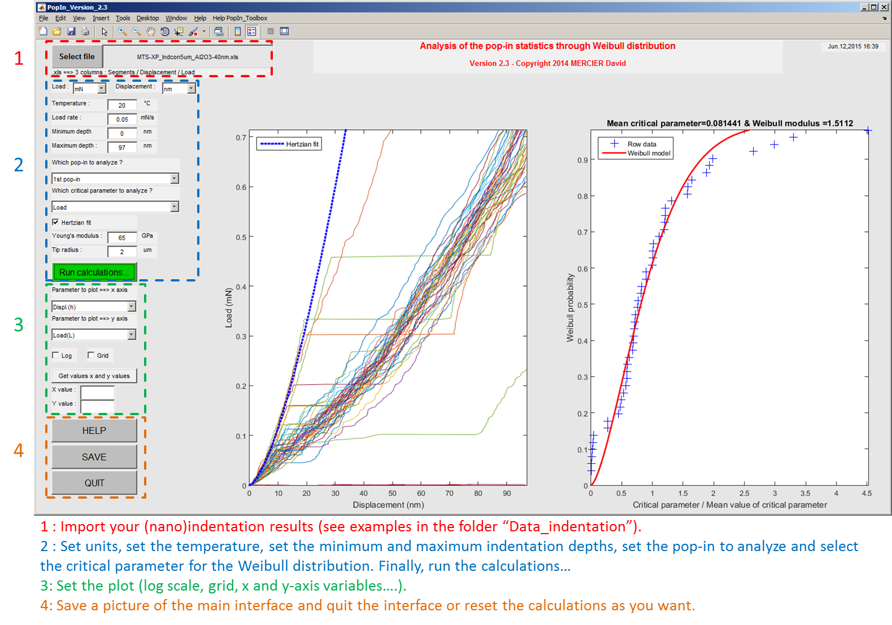

.. Matlab documentation master file, created by
   sphinx-quickstart on Fri Apr 04 20:28:37 2014.
   You can adapt this file completely to your liking, but it should at least
   contain the root `toctree` directive.
   
.. include:: includes.rst

PopIn |matlab| toolbox
=======================

This toolbox has been developed to plot (nano)indentation data and to analyze the pop-in distribution.

With this Matlab toolbox, it is possible to :
    * plot load-displacement curves;
    * plot Weibull distribution (with 2 parameters) of the 1st or the 2nd pop-in;;
    * and finally to assess the Weibull parameters (mean critical load or displacement and Weibull modulus).
   

   
   *Screenshot of the main window of the PopIn toolbox.*

Contents
=========
   
.. toctree::
   :maxdepth: 3
   
   getting_started
   overview_of_the_toolbox
   models
   examples.rst
   links_ref
   
Contact
=======
:Author: `David Mercier <david9684@gmail.com>`_ [1]

[1] `Max-Planck-Institut für Eisenforschung, 40237 Düsseldorf, Germany <http://www.mpie.de/>`_

Keywords
========
|matlab| toolbox ; Graphical User Interface (GUI) ; nanoindentation ; pop-in ; cumulative distribution ; Weibull ; 
statistics ; load-displacement curve ; survival probability ; critical load ; critical displacement.
