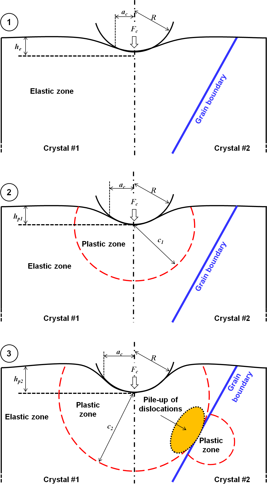

Statistical models
======================

.. include:: includes.rst

Nanoindentation experiment
############################

The nanoindentation (or instrumented or depth sensing indentation) is a variety
of indentation hardness tests applied to small volumes. During nanoindentation,
an indenter is brought into contact with a sample and mechanically loaded.

The following parts give a short overview of models existing in the
literature used for the extraction of mechanical properties of homogeneous 
bulk materials from indentation experiments with conical indenters.

Parameters such as contact load :math:`F_\text{c}` and depth of penetration :math:`h` are recorded
at a rapid rate (normally 10Hz) during loading and unloading steps of the indentation test.
Usually, the depth resolution is around the :math:`\angstrom` level and the load resolution is around :math:`\text{nN}`-level.

During the loading step of nanoindentation, a discontinuity in the measured depth is commonly referred to as a pop-in event.

The pop-in event
###################

A pop-in (event) is a sudden displacement burst during the loading of an indenter on a sample.
If the nanoindentation experiment is load-controlled, an horizontal plateau is also observed on the 
load-displacement curve, when a pop-in occurs at the critical load :math:`F_\text{crit}` and
critical displacement :math:`h_\text{crit}` (see Figure 1). In the case of a displacement-controlled
nanoindentation experiments, a vertical drop of the load is observed on the load-displacement curve.

.. figure:: ./_pictures/load-disp_curve_popin.png
   :scale: 60 %
   :align: center
   
   *Figure 1 : Schematics of indentation load-displacement curve with a pop-in: a) load-controlled and b) displacement-controlled nanoindentation experiments.*

.. warning::
    In this toolbox, only load controlled nanoindentation experiment are analyzed.

Many authors observed pop-in events on metals or metallic thin films, ceramics, semiconductors, hard brittle thin films deposited on a soff elastoplastic substrate...

The pop-in event is often explained by on of the following mechanisms in function of the indented specimen
and the experimental conditions :

- dislocations nucleation (= sudden yielding of a material under load) ;

- rupture of a hard brittle film on an elastic-plastic substrate ;

- crack(s) formation ; 

- phase transformation ;

- strain transfer across a grain boundary.

Weibull-type distribution
#################################

A Weibull-type distribution is used as a survival probability in this toolbox for
the description of the statistics of the pop-in event [#Weibull_1951]_ and [#Chechenin_1995]_ :

    .. math:: W\left(\frac{F_\text{crit}}{F^0_\text{crit}}\right) = exp\left(-ln2\left(\frac{F_\text{crit}}{F^0_\text{crit}}\right)^m\right)
            :label: Weibull

:math:`W` is the survival probability function.
:math:`F_{cr}` is the critical load at which the pop-in event appears for a given load-displacement curve.
:math:`F^0_{cr}` is the mean critical load at which the pop-in event appears.
:math:`m` is a material constant, often named the Weibull modulus. Higher is :math:`m`, more homogeneous is 
the distribution of the pop-in.

This Weibull-type distribution is modified to have a probability of 0.5, when :math:`F_{cr}` (the critical load)
is equal to :math:`F^0_{cr}` (the mean critical load).

The same Weibull-type distribution can be used for the critical displacement :math:`h_{cr}`.

Rupture of a hard brittle film on an elastic-plastic substrate
################################################################

    .. math:: c = \sqrt{\frac{3F_\text{c}}{2\pi\sigma_\text{e}}}
            :label: plastic_zone_radius

.. figure:: ./_pictures/popin_mechanisms_2.png
   :scale: 60 %
   :align: center
   
   *Figure 2 : Schematic cross section of deformation profile of a hard brittle film on an elastic-plastic substrate under indentation.*

   
Statistical investigation of the onset of plasticity
######################################################

   
   *Figure 3 : Schematic cross section of deformation profile of an elastic-plastic substrate under indentation.*

==> rate dependence and temperature dependence of incipient plasticity

cumulative statistics

Strain transfer across grain boundaries
######################################################

[#Mercier_2015]_
[#STABiX]_

See Figure 3-3...

.. figure:: ./_pictures/load-disp_curve_two_popin_Hertzian_fit.png
   :scale: 60 %
   :align: center
   
   *Figure 4 : Schematics of indentation load-displacement curve with two pop-in events (the 1st for the nucleation of dislocation and the 2nd for the strain transfer across a grain boundary.*

References
#############

.. [#Weibull_1951] `Weibull W., "A statistical distribution function of wide applicability", J. Appl. Mech.-Trans. ASME (1951), 18(3). <http://www.barringer1.com/wa_files/Weibull-ASME-Paper-1951.pdf>`_
.. [#Chechenin_1995] `Chechenin N.G., Bøttiger J., Krog J.P., "Nanoindentation of amorphous aluminum oxide films II. Critical parameters for the breakthrough and a membrane effect in thin hard films on soft substrates.", Thin Solid Films (1995), 261(1-2), pp.228-235. <http://dx.doi.org/10.1016/S0040-6090(94)06494-6>`_
.. [#Mercier_2015] `Mercier D. et al. "A Matlab toolbox to analyze slip transfer through grain boundaries" (2015) <http://dx.doi.org/10.1088/1757-899X/82/1/012090>`_
.. [#STABiX] `STABiX toolbox <http://stabix.readthedocs.org/en/latest/>`_