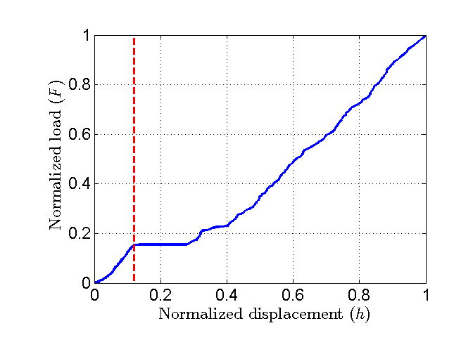
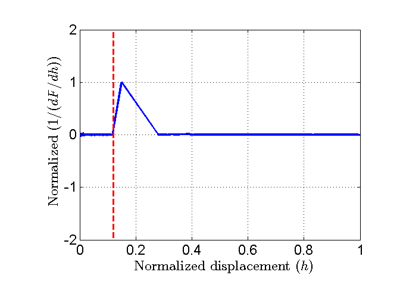
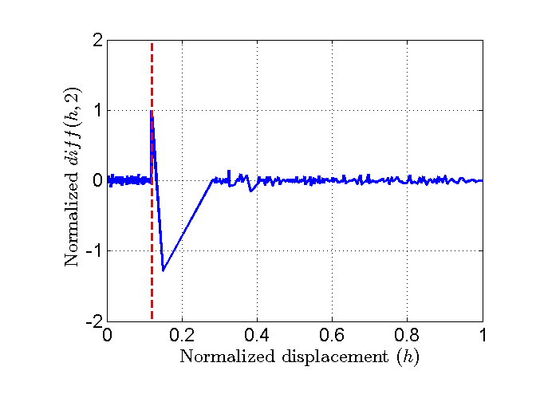
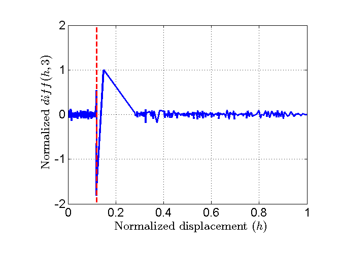
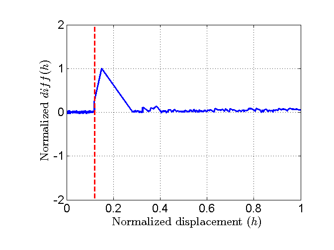
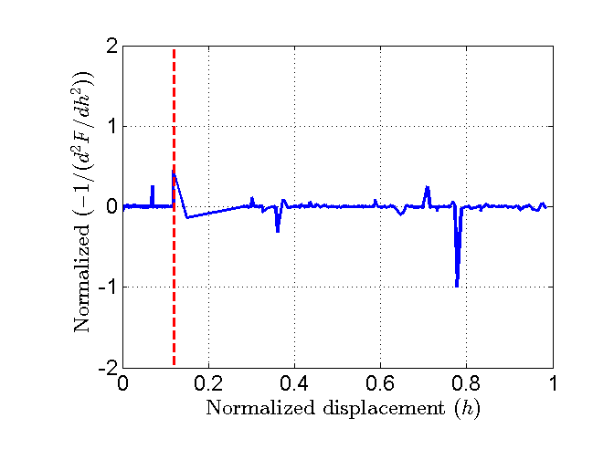
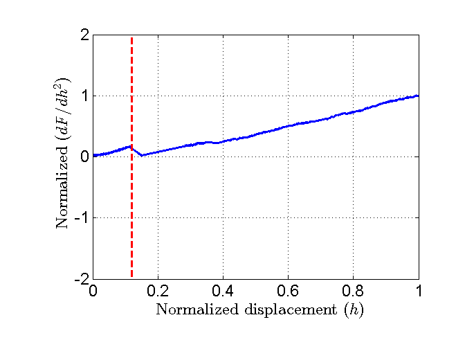

The 'pop-in' detection
==========================

.. include:: includes.rst

The pop-in detection in the literature
###################################################

In 2001, Malzbender J. et al. proposed to use the derivative :math:`dF/dh^{2}` vs. :math:`h^{2}` of the indentation load-displacement
data for the pop-in detection [#Malzbender_2001]_. Minima on these curves correspond to pop-in on the load-displacement curve.

In his algorithm, Askari H. et al. proposed the following criteria to detect a pop-in [#Askari]_:

    * Absolute change in depth over 2 lines of data: :math:`\Delta h = h(i) - h(i-1)`
    * Forward 2 pts avg - trailing 2 pts average: :math:`\Delta h = (h(i)+h(i+1))/2 - (h(i-1)+h(i-2))/2`
    * Forward 3 pts avg - trailing 3 pts average: :math:`\Delta h = (h(i)+h(i+1)+h(i+2))/3 - (h(i-1)+h(i-2)+h(i-3))/3`
	
The absolute step size is the difference beteen two (or more in case averaging is active) consecutive depth readings from the machine.
If this step size exceeds a user defined number then it is considered as pop-in.

The pop-in detection in the PopIn Matlab toolbox
###################################################

In the PopIn Matlab toolbox, numerous criteria based on the function `diff <http://nl.mathworks.com/help/matlab/ref/diff.html>`_, are implemented to detect pop-in on the load-displacement curve:

    * Criterion 1 - Differences between adjacent depths: :math:`\Delta h = diff(h) = h(i+1) - h(i)`
    * Criterion 2 - 2nd differences between adjacent elements (the diff operator is used 2 times): :math:`\Delta h = diff(diff(h)) = diff(h,2)`
    * Criterion 3 - 3rd differences between adjacent elements (the diff operator is used 3 times): :math:`\Delta h = diff(diff(diff(h))) = diff(h,3)`
    * Criterion 4 - 1st derivative of the load-displacement curve: :math:`1/(dF/dh) = 1/(diff(F)/diff(h))`
    * Criterion 5 - 2nd derivative of the load-displacement curve: :math:`-1/(d^{2}F/dh^{2}) = -1/(diff(dF/dh)/diff(h))`
    * Criterion 6 - Derivative of the load-displacement curve: :math:`(dF/dh^{2}) = ((diff(F)/diff(h))/diff(h))`

The 6th criterion is based on the one proposed by Malzbender et al. [#Malzbender_2001]_.

When a pop-in occurs, a peak is observed on the plot of differences or derivatives. To have only positive peaks, derivatives are multiplied by -1. Peaks anaysis is performed using the function `peakdet <https://github.com/DavidMercier/PopIn/blob/master/third_party_codes/peakdet.m>`_ released by E. Billauer to the public domain (http://www.billauer.co.il/peakdet.html). Only positive peaks are counted. A point is considered a maximum peak if it has the maximal
%        value, and was preceded (to the left) by a value lower by a given delta.

Plot of the different criteria

   
   *Plot of an experimental load-displacement curve displaying a pop-in.*

   
   *Plot of the normalized 1st criterion.*

   
   *Plot of the normalized 2nd criterion.*

   
   *Plot of the normalized 3rd criterion.*
   

   
   *Plot of the normalized 4th criterion.*
   

   
   *Plot of the normalized 5th criterion.*
   

   
   *Plot of the normalized 6th criterion.*

References
#############

.. [#Askari] `Pop-in Detection by Askari H. et al. <https://nanohub.org/resources/20804>`_
.. [#Malzbender_2001] `Malzbender J. and de With  G., "The use of the indentation loading curve to detect fracture of coatings" (2001). <http://dx.doi.org/10.1016/S0257-8972(00)01091-4>`_
