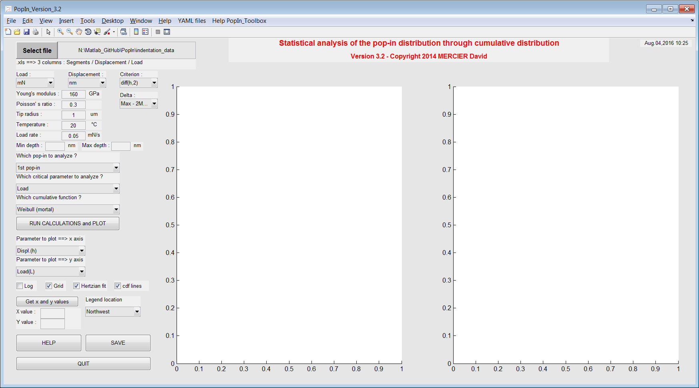
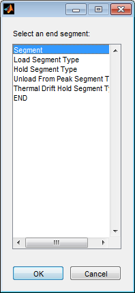
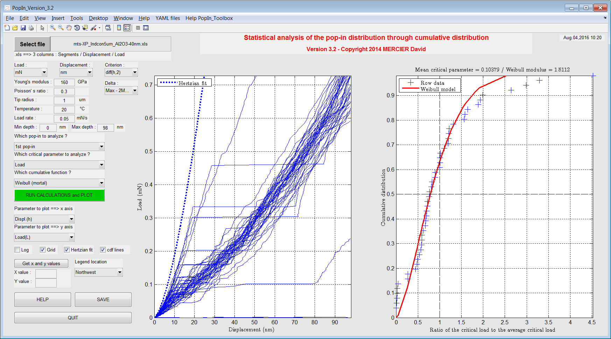
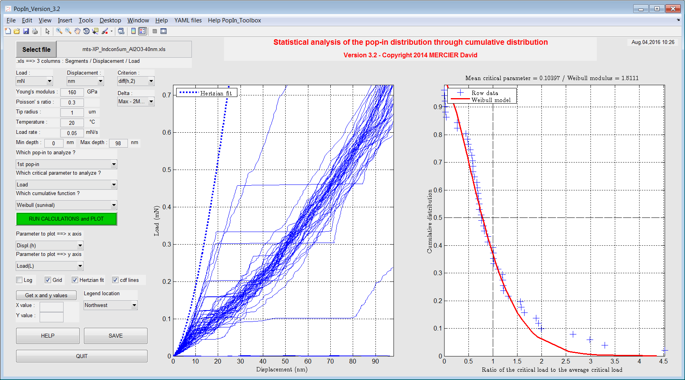

Getting started
================

.. include:: includes.rst

First of all, download the source code of the |matlab| toolbox.

`Source code is hosted at Github. <https://github.com/DavidMercier/PopIn>`_

To have more details about the use of the toolbox, please have a look to :

.. code-block:: matlab

   README.txt

How to use the GUI for "pop-in" analysis from indentation tests ?
#################################################################

First of all a GUI is a Graphical User Interface.

* Run the following |matlab| script :

.. code-block:: matlab

   demo.m
   
* Answer 'y' or 'yes' (or press 'Enter') to add path to the |matlab| search paths, using this script:

.. code-block:: matlab

   path_management.m

* The following window opens:

   
   *Screenshot of the main window of the PopIn toolbox.*

* Import your (nano)indentation results (.xls file obtained from MTS software with at least more than 20 indentation tests for statistics), by pressing the button 'Select file'.
* Select the end segment (if segments exist), in order to set the maximum indentation depth.
* Set units and criterion to detect pop-in.
* Once the dataset is loaded and parameters set, run calculations by pressing the green button 'RUN CALCULATIONS and PLOT'.
* Load-displacement curves and selected cumulative distribution function (cdf) are plotted respectively on the left graphic and the right graphic.
* A picture of the main window as .png file is created and cdf fit results are stored in a .txt file when you press the button 'SAVE'.
* Results are accessible by typing in the Matlab command window (here for 50 indentation tests) : 

.. code-block:: matlab

   gui = guidata(gcf)
   
   gui =
        config: [1x1 struct]                % config. of the GUI
        data_xls: [1x1 struct]              % details about .xls file
        handles: [1x1 struct]               % handles of the GUI = buttons, boxes...
        settings: [1x1 struct]              % settings of the GUI
        flag: [1x1 struct]                  % flags for errors, calculations
        data: [1x50 struct]                 % data cropped
        results: [50x1 struct]              % results obtained after calculations
        Hertz: [1x1 struct]                 % details about hertzian fit
        cumulativeFunction: [1x1 struct]    % cdf fit results

   
   *File selector.*

   
   *Plot of the load-displacement curves and the mortal Weibull cdf after loading of data.*
   

   
   *Plot of the load-displacement curves and the survival Weibull cdf.*
   

   
   *Plot of the load-displacement curves and the mortal modified Weibull cdf (Chechenin's model).*
   
The YAML configuration files
#################################

Default YAML configuration files, stored in the folder `yaml_config_files <https://github.com/DavidMercier/PopIn/tree/master/yaml_config_files>`_, are loaded automatically to set the GUI:

* `data_config.yaml <https://github.com/DavidMercier/PopIn/blob/master/yaml_config_files/data_config_popin.yaml>`_
* `indenters_config.yaml <https://github.com/DavidMercier/PopIn/blob/master/yaml_config_files/indenter_config_popin.yaml>`_
* `numerics_config.yaml <https://github.com/DavidMercier/PopIn/blob/master/yaml_config_files/numerics_config_popin.yaml>`_

You have to update these YAML config. files, if you want to change indenter properties, constant parameters of models and constant parameters of the least-square method used to solve nonlinear curve-fitting and the path to your datasets.

`Visit the YAML website for more informations <http://www.yaml.org/>`_.

`Visit the YAML code for Matlab <http://code.google.com/p/yamlmatlab/>`_.

Links
#######

* `Guidata on Matlab website. <https://www.mathworks.com/help/matlab/ref/guidata.html>`_
* `fitdist - Fit probability distribution object to data <http://de.mathworks.com/help/stats/fitdist.html>`_
* `dfittool - Open Distribution Fitting app <http://de.mathworks.com/help/stats/dfittool.html>`_
