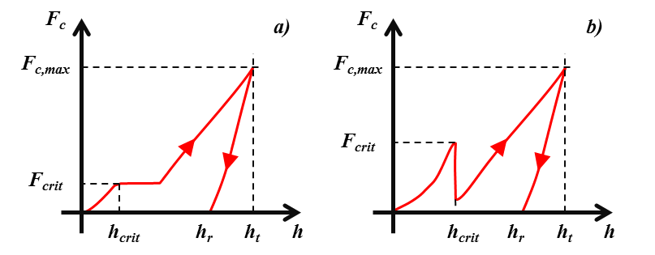
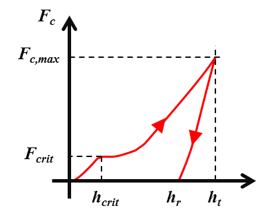
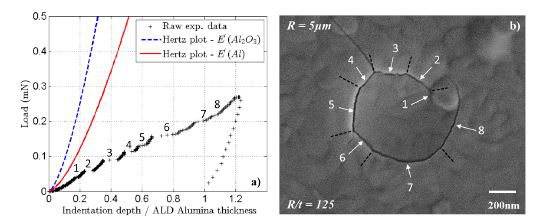
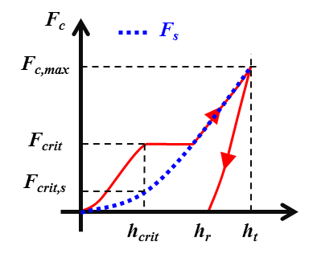
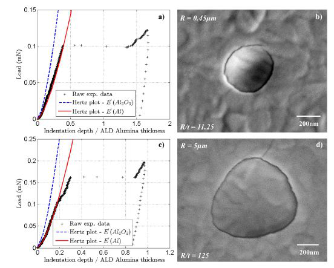

The 'pop-in' phenomenon
==========================

.. include:: includes.rst

The nanoindentation (or instrumented or depth sensing indentation) is a variety
of indentation hardness tests applied to small volumes. During nanoindentation,
an indenter is brought into contact with a sample and mechanically loaded.

The following parts give a short overview of models existing in the
literature used for the extraction of mechanical properties of homogeneous 
bulk materials from indentation experiments with conical indenters.

Parameters such as contact load :math:`F_\text{c}` and depth of penetration :math:`h` are recorded
at a rapid rate (normally 10Hz) during loading and unloading steps of the indentation test.
Usually, the depth resolution is around the fraction of :math:`\text{nm}`-level and the resolution is around :math:`\text{nN}`-level.

During the loading step of nanoindentation, a discontinuity in the measured depth is commonly referred to as a pop-in event.

The pop-in event
###################

A pop-in (event) is a sudden (load or displacement) burst during the loading of an indenter on a sample.
If the nanoindentation experiment is load-controlled, an horizontal plateau is also observed on the 
load-displacement curve, when a pop-in occurs at the critical load :math:`F_\text{crit}` and
critical displacement :math:`h_\text{crit}` (see :numref:`load_disp_curve_popin`). In the case of a displacement-controlled
nanoindentation experiments, a vertical drop of the load is observed on the load-displacement curve.

   
   *Schematics of indentation load-displacement curve with a pop-in: a) load-controlled and b) displacement-controlled nanoindentation experiments.*

:math:`F_\text{c,max}` is the maximum applied load, :math:`h_\text{t}` is the total indentation depth and
:math:`h_\text{r}` is the residual indentation depth.

Find here the |matlab| function to quantify pop-in by peak detection:
`peakdet.m <https://github.com/DavidMercier/PopIn/blob/master/matlab_code/third_party_codes/peakdet.m>`_.

.. warning::
    In this toolbox, only load-controlled nanoindentation experiments are analyzed.

Many authors observed pop-in events on metals or metallic thin films, ceramics, metallic glasses, semiconductors, hard brittle thin films deposited on a soft elastoplastic substrate...

The pop-in event is often explained by on of the following mechanisms as a function of the indented specimen (ceramic, metal, semiconductor, coated or multilayer specimen...)
and the experimental conditions (time, temperature, geometry of the indenter...) :

    * :ref:`dislocation_nucleation` (= sudden yielding of a material under load) ;
    * :ref:`film_fracture` ;
    * :ref:`strain_transfer` ;
    * crack(s) formation ; 
    * phase transformation ;
    * amorphization, densification...
    
It is really important to mention that pop-in events are function of the indenter shape [#Schuh_2004]_, [#Jang_2007]_, the temperature [#Schuh_2005]_ and the strain rate [#Schuh_2004]_, [#Nieh_2002]_.

In parallel, pop-in event is not always a perfect plateau (with a null slope) on the load-displacement curve. Sometimes, sliding pop-in are occuring with no observable end point, or for example pop-in can be a serie of little plateaus. In the literature, some authors classified the different pop-in shapes [#Hull_2021]_ (in the case of load-controlled measurement):
    * Type I = slope :math:`dF_\text{c}/dh = 0`, corresponding to the "perfect" plateau, which are often described as a sudden instantaneous elastic perfectly plastic “Coulomb-type” failure and sudden grain dislodging
    * Type II = slope :math:`dF_\text{c}/dh > 0`, corresponding to a sliding pop-in, which can be related to shear band progressive failure and/or grain sliding or progressive pile-up. According to the litterature, such sliding pop-in are detected during experiments given the high-resolution of transducer [#Fu_2016]_.	
    * Type III = :math:`dF_\text{c}/dh < 0`, which should not appears in the case of load-control indentation tests. If it is happening, it should be more related to wrong setting of the control loop or an acquisition bug.

   
   *Schematics of indentation load-displacement curve with a sliding pop-in.*
	
For the serie of little plateaus, it is more often observed in the case of successive failures of brittle thin film on elastic-plastic substrate [#Mercier_2017]_ (see picture below),
but it can be also observed for crystals deformation [#Xia_2016]_.

   
   *Load-displacement curve with relatively small displacement excursions (on the left) and corresponding SEM observation.*

Some authors proposed to describe the statistics of the pop-in event with a cumulative Weibull-type distribution [#Chechenin_1995]_ or with a cumulative fraction function based on a rate equation, when a time or a temperature dependence of the pop-in is demonstrated.

Weibull-type distribution
#################################

The `cumulative Weibull distribution function <https://en.wikipedia.org/wiki/Weibull_distribution>`_
with 2 parameters :math:`(\lambda, m)` is a continuous probability distribution
and is often used in the description of particle size distribution and in survival or failure analysis [#Weibull_1951]_.

    .. math:: V\left(x, \lambda, m\right) = exp\left(\left(\frac{x}{\lambda}\right)^m\right)
            :label: weibull_survival

    .. math:: W\left(x, \lambda, m\right) = 1 - exp\left(\left(\frac{x}{\lambda}\right)^m\right)
            :label: weibull_mortality

With :math:`V` the survival probability function and :math:`W` the mortal probability function.
:math:`m` is a dimensionless material-dependent constant, often named the Weibull modulus (from 0 to usually 50) [#Afferante_2006]_.
If :math:`m=1`, the rate of failure remains constant and there is random failure occurring.

In the case of several indentations performed on the same sample,
:math:`x` can be the distribution of the critical loads :math:`F_\text{crit}` or the critical displacements :math:`h_\text{crit}`,
at which the pop-in events appear on the corresponding load-displacement curves. In this case, 
higher is :math:`m`, more homogeneous is the distribution of the pop-in.

:math:`\lambda` is the scale parameter of the cumulative Weibull distribution.
In the case of indentations, :math:`\lambda` is the mean critical load :math:`F^0_{crit}` or
the mean critical displacement :math:`h^0_{crit}` at which the pop-in event appears for a given material.

Find here the |matlab| function to calculate the cumulative mortal Weibull distribution:
`weibull_cdf.m <https://github.com/DavidMercier/PopIn/blob/master/matlab_code/statistics/weibull/weibull_cdf.m>`_.

Find here the |matlab| function to calculate the complementary cumulative survival Weibull distribution:
`weibull_cdf_survival.m <https://github.com/DavidMercier/PopIn/blob/master/matlab_code/statistics/weibull/weibull_cdf_survival.m>`_.

Chechenin et al. proposed to use a modified cumulative Weibull distribution function for
the description of the statistics of the pop-in event [#Chechenin_1995]_.
This function is set to have a probability of 0.5, when :math:`F_{crit}` (the critical load)
is equal to :math:`F^0_{crit}` (the mean critical load).

    .. math:: W\left(\frac{F_\text{crit}}{F^0_\text{crit}}\right) = 1 - exp\left(-ln2\left(\frac{F_\text{crit}}{F^0_\text{crit}}\right)^m\right)
            :label: weibull_modified

The cumulative Weibull distribution [#Weibull_1951]_ and the modified cumulative Weibull distribution [#Chechenin_1995]_
are implemented in the PopIn toolbox.

Find here the |matlab| function to calculate the cumulative modified mortal Weibull distribution:
`weibull_modified_cdf.m <https://github.com/DavidMercier/PopIn/blob/master/matlab_code/statistics/weibull/weibull_modified_cdf.m>`_.

Find here the |matlab| function to calculate the complementary cumulative modified survival Weibull distribution:
`weibull_modified_cdf_survival.m <https://github.com/DavidMercier/PopIn/blob/master/matlab_code/statistics/weibull/weibull_modified_cdf_survival.m>`_.

.. _dislocation_nucleation:

Dislocations nucleation
###############################

According to many authors, pop-in corresponds to the nucleation of at least one dislocation, during indentation
of crystalline materials (see :numref:`popin_mechanisms_1`) [#Schuh_2004]_, [#Schuh_2005]_, [#Schuh_2006]_, [#Mason_2006]_, [#Wo_2006]_, [#Morris_2011]_,
[#Lu_2012]_, [#Ramalingam_2012]_, [#Wu_2014_1]_ and [#Wu_2014_2]_. Before the pop-in event, the indentation load-displacement
obtained with a spherical indenter, can be fitted with the Hertz equation (see :numref:`load_disp_curve_two_popin_Hertzian_fit`) [#Johnson_1987]_:

    .. math:: F_\text{c}  = (4/3) E^{*} \sqrt{R^{*}} h_\text{crit}^{1.5}
            :label: Hertz_equation

With :math:`E^{*}` the reduced Young's modulus calculated from indentation test defined by :eq:`reduced_youngs_modulus` and 
:math:`R^{*}` the reduced radius of the spherical indenter defined by :eq:`reduced_radius`.

    .. math:: \frac{1}{E^{*}} = \frac{1}{E_\text{s}^{'}} + \frac{1}{E_\text{i}^{'}}
            :label: reduced_youngs_modulus

With :math:`E_\text{s}^{'}` the reduced Young's modulus of the sample and :math:`E_\text{i}^{'}` the reduced Young's modulus of the indenter.

    .. math:: \frac{1}{R^{*}} = \frac{1}{R_\text{s}} + \frac{1}{R_\text{i}}
            :label: reduced_radius

With :math:`R_\text{s}` the radius of the sample (usually :math:`+\infty`) and :math:`R_\text{i}` the radius of the indenter.

Find here the |matlab| function to calculate the load with the Hertz equation:
`elasticLoad.m <https://github.com/DavidMercier/PopIn/blob/master/matlab_code/elastic_contact/elasticLoad.m>`_.

Find here the |matlab| function to calculate the displacement with the Hertz equation:
`elasticDisp.m <https://github.com/DavidMercier/PopIn/blob/master/matlab_code/elastic_contact/elasticDisp.m>`_.

Find here the |matlab| function to calculate the contact radius with the Hertz equation:
`elasticRadius.m <https://github.com/DavidMercier/PopIn/blob/master/matlab_code/elastic_contact/elasticRadius.m>`_.

Find here the |matlab| function to calculate the reduced value of a variable:
`reducedValue.m <https://github.com/DavidMercier/PopIn/blob/master/matlab_code/elastic_contact/reducedValue.m>`_.

.. figure:: ./_pictures/popin_mechanisms_1.png
   :name: popin_mechanisms_1
   :scale: 30 %
   :align: center

   *Schematics cross section of deformation profile of an elastic-plastic substrate under indentation :
   1) elastic deformation, 2) elastoplastic deformation (nucleation of dislocation) and 3) transfer of dislocations across a grain boundary.*
            
.. figure:: ./_pictures/load-disp_curve_two_popin_Hertzian_fit.png
   :name: load_disp_curve_two_popin_Hertzian_fit
   :scale: 60 %
   :align: center
   
   *Schematic of indentation load-displacement curve with two pop-in events (the 1st for the nucleation of dislocation and the 2nd for the strain transfer across a grain boundary).*
   
The elastic-plastic transition is often studied statistically as a function of temperature :math:`T` and indentation rate :math:`F(t)`.
Schuh C.A. et al. observed a good consistency between experimental results and a thermally activated mechanism of incipient plasticity 
[#Schuh_2004]_, [#Schuh_2005]_, [#Schuh_2006]_, [#Mason_2006]_. They also proposed to use a statistical thermal activation model (see following equations) 
with a stress-biasing term. Based on this model, it is possible to extract the activation energy :math:`\epsilon-\sigma V`, activation volume :math:`V`,
and attempt frequency for the rate-limiting event that controls yield :math:`W(F_\text{c})`. The activation energy :math:`\epsilon-\sigma V` is separated into a
term characterizing the activation enthalpy :math:`\epsilon`, and a term giving the stress bias :math:`\sigma V`,
where :math:`\sigma` is the biasing stress over the activation volume :math:`V`.

    .. math:: \dot{n} = \eta exp\left(-\frac{\epsilon-\sigma V}{kT}\right)
            :label: rate_equation
            
    .. math:: \dot{N} = \eta exp\left(-\frac{\epsilon}{kT}\right)\cdot\int\int\limits_\Omega\int exp \left(\frac{\sigma V}{kT}\right)d\Omega
            :label: global_rate_equation

    .. math:: \dot{F}(t) = \left[1-F(t)\right]{N}(t)
            :label: cumulative fraction function
            
    .. math:: F(t) = 1- exp\left(-\int_{0}^{t}{\dot{N}(t')dt'}\right)
            :label: integrated_cumulative fraction function

    .. math:: \tau_\text{max} = 0.31p_0 = 0.47p_\text{max} = \left(\frac{0.47}{\pi}\right)\left(\frac{4E^{*}}{3R^{*}}\right)F^{1/3}_{crit}
            :label: max_Hertzian_shearStress
            
    .. math:: \Omega \approx Ka^3 = K\left(\frac{3F_{crit}R^{*}}{4E^{*}}\right)
            :label: sampling_volume
            
    .. math:: F_\text{c} = \dot{F_\text{c}}\cdot t
            :label: loadrate

With :math:`\dot{n}` is the local rate at which the critical event occurs per unit volume of material, 
:math:`\eta` the pre-exponential frequency factor, :math:`k` the Boltzmann constant, :math:`\tau_\text{max}` the maximun shear stress
obtained for the maximum pressure :math:`p_\text{max}`, at a single point beneath the indenter given for an elastic Hertzian contact [#Johnson_1987]_. :math:`K` is a proportionality constant of order :math:`\pi`.

Find here the |matlab| function to calculate the maximum shear stress:
`maxShearStress.m <https://github.com/DavidMercier/PopIn/blob/master/matlab_code/elastic_contact/maxShearStress.m>`_.

Find here the |matlab| function to calculate the maximum pressure:
`maxPressure.m <https://github.com/DavidMercier/PopIn/blob/master/matlab_code/elastic_contact/maxPressure.m>`_.

Find here the |matlab| function to calculate the mean pressure:
`meanPressure.m <https://github.com/DavidMercier/PopIn/blob/master/matlab_code/elastic_contact/meanPressure.m>`_.

Finally, a statistical expression of the onset of plasticity can be formulated by combining previous equations, giving the cumulative fraction function :math:`W(F_\text{c})` :

    .. math:: W(F_\text{c}) = 1-exp\left(-\frac{9KR^{*}\eta}{4E^{*}\dot{F_\text{c}}\alpha^6}exp\left(-\frac{\epsilon}{kT}\right)\left(\beta(\alpha,F_\text{c})\right)\right)
            :label: first_order_analytical_solution
            
    .. math:: \alpha = \left(\frac{0.47}{\pi}\right)\left(\frac{4E^{*}}{3R^{*}}\right)^{2/3}\frac{V}{kT}
            :label: alpha_function
            
    .. math:: \beta = 120exp(-F_\text{c}^{1/3}\alpha) + F_\text{c}^{5/3}\alpha^5 - 5F_\text{c}^{4/3}\alpha^4 + 20F_\text{c}\alpha^3-60F_\text{c}^{2/3}\alpha^2+120F_\text{c}^{1/3}\alpha-120
            :label: beta_function

Find here the |matlab| function to calculate the cumulative survival distribution as a function of the load rate and the temperature of nanoindentation tests:
`mason_cdf.m <https://github.com/DavidMercier/PopIn/blob/master/matlab_code/statistics/mason/mason_cdf.m>`_.

Find here the |matlab| function to calculate the :math:`\alpha` function:
`alphaMason.m <https://github.com/DavidMercier/PopIn/blob/master/matlab_code/statistics/mason/alphaMason.m>`_.

Find here the |matlab| function to calculate the :math:`\beta` function:
`betaMason.m <https://github.com/DavidMercier/PopIn/blob/master/matlab_code/statistics/mason/betaMason.m>`_.

.. note::
    The surface mechanical state (presence of dislocations after polishing steps or surface free of dislocation)
    can modified the statistics of pop-in behavior [#Wang_2012]_.
    
.. note::
    See this `Github repository <https://github.com/DavidMercier/Matlab_functions/tree/master/mechanicalContact/hertzEquations>`_ for the plot of stress distributions at the surface and along the axis of symmetry,
    caused by Hertz pressure acting on a circular area radius.

In the case of prismatic dislocation loops beneath the indenter generated during pop-in, an energy balance model was also proposed by Wang D. et al. in 2021 [#Wang_2021]_.

Finally, after a short survey of the literature, it appears that pop-in or strain burst events are observed as well,
on the load-displacement or stress-strain curves obtained during compression tests of metallic nano- or micro-pillar [#Bei_2008]_, [#Crosby_2015]_ and [#Kraft_2010]_. This strain burst is most of the time, attributed to the nucleation of dislocations into the pillar, initially dislocation-free.

.. _strain_transfer:
    
Strain transfer across grain boundaries in metals
####################################################

Some authors observed sometimes two pop-in on the load-displacement curve during indentation performed close to a grain boundary
(see :numref:`popin_mechanisms_1` and :numref:`load_disp_curve_two_popin_Hertzian_fit`).
The first pop-in is usually attributed to the nucleation of dislocation in a metallic material
(see previous section of this documentation), and the second pop-in is related to the presence nearby of the grain boundary.
 
The occurrence of such a strain burst is found to be related to the slip activity (function of the phase material and the grain orientation),
to the grain boundary resistance (function of the grain boundary misorientation [#Wang_2004]_, 
to the local chemistry [#Britton_2011]_ (impurities, embrittled hydrogen...), to the prior plastic deformation [#Britton_2011]_, to
the distance between the indenter and the grain boundary [#Wang_2004]_,
or other experimental parameters like the shape of the indenter and the grain boundary inclination...

Recently, the `STABiX Matlab toolbox <https://github.com/stabix/stabix>`_
was developed to analyse in simple way slip transmission in a bicrystal [#Mercier_2015]_, [#StabixDoc_2015]_ and [#StabixRepo_2015]_.

.. _film_fracture:

Rupture of a hard brittle film on an elastic-plastic substrate
################################################################

In the case of indentation made into a hard brittle film (e.g.: native or thermally/anodically grown oxide, ALD coatings ...)
on an elastic-plastic (ductile) substrate, pop-in were observed experimentally and linked to the fracture of the brittle film 
[#Kramer_2001]_, [#Bahr_2003]_, [#Morash_2007]_ and [#Stauffer_2012]_ and a real example from [#Mercier_2017]_ is given below.

   *Schematic of indentation load-displacement curve with a pop-in event and the plot of the load carried by the elastic-plastic substrate.*
   

   *Example of load-displacement curves with a pop-in event (on the left) and the corresponding SEM observations substrate (on the right).*

Some authors explained that a circumferential crack appears at the location of the elastic–plastic boundary in the substrate [#Bahr_2003]_ and [#Morash_2007]_.
The radius :math:`c` of this plastic zone in the ductile substrate is defined by the following equation:

    .. math:: c = \sqrt{\frac{3F_\text{crit,s}}{2\pi\sigma_\text{e}}}
            :label: plastic_zone_radius

With :math:`F_\text{crit,s}` the load carried by the substrate at the critical indentation depth at which pop-in occurs,
obtained usually with the power law relationship :eq:`critical_load_substrate`.
:math:`\sigma_\text{e}` is the yield stress of the ductile substrate [#Hainsworth_1995]_.

    .. math:: F_\text{crit,s} = Kh_\text{crit}^n
            :label: critical_load_substrate

With :math:`h_\text{crit}` the critical displacement at which the pop-in appears.
The two constants :math:`K` and :math:`n` are obtained from a fitting procedure of the load-displacement curve
obtained from nanoindentation tests performed on the substrate without the brittle film.

.. figure:: ./_pictures/popin_mechanisms_2.png
   :name: popin_mechanisms_2
   :scale: 30 %
   :align: center

   *Schematic cross section of deformation profile of a hard brittle film on an elastic-plastic substrate under indentation.*
   
In the :numref:`popin_mechanisms_2`, :math:`R` is the radius of the spherical indenter, :math:`t` is the thickness of the thin film, :math:`F_\text{c}` is the applied load,
:math:`h` is the indentation displacement, :math:`c` the radius of the plastic zone in the substrate and :math:`a_\text{c}` the contact radius between the indenter and the thin film.

Find here the |matlab| function to calculate the plastic radius :math:`c`:
`plasticRadius.m <https://github.com/DavidMercier/PopIn/blob/master/matlab_code/plastic_contact/plasticRadius.m>`_.

Find here the |matlab| function to fit a load-displacement curve:
`load_displacement_fit.m <https://github.com/DavidMercier/PopIn/blob/master/matlab_code/plastic_contact/load_displacement_fit.m>`_.

Matlab functions to fit probability distributions
###################################################

* `disttool - Interactive density and distribution plots <http://de.mathworks.com/help/stats/disttool.html>`_
* `fitdist - Fit probability distribution object to data <http://de.mathworks.com/help/stats/fitdist.html>`_
* `dfittool - Open Distribution Fitting app <http://de.mathworks.com/help/stats/dfittool.html>`_

References
#############

.. [#Afferante_2006] `Afferante L. et al., "Is Weibull’s modulus really a material constant? Example case with interacting collinear cracks" (2006). <https://doi.org/10.1016/j.ijsolstr.2005.08.002>`_
.. [#Bahr_2003] `Bahr D.F. et al., "Indentation induced film fracture in hard film – soft substrate systems" (2003). <https://doi.org/10.1023/A:1024979030155>`_
.. [#Bei_2008] `Bei H. et al., "Effects of pre-strain on the compressive stress–strain response of Mo-alloy single-crystal micropillars" (2008). <https://doi.org/10.1016/j.actamat.2008.05.030>`_
.. [#Britton_2011] `Britton T.B. et al., "Nanoindentation study of slip transfer phenomenon at grain boundaries" (2011). <https://doi.org/10.1557/jmr.2009.0088>`_
.. [#Chechenin_1995] `Chechenin N.G. et al., "Nanoindentation of amorphous aluminum oxide films II. Critical parameters for the breakthrough and a membrane effect in thin hard films on soft substrates." (1995). <https://doi.org/10.1016/S0040-6090(94)06494-6>`_
.. [#Crosby_2015] `Crosby T. et al., "The origin of strain avalanches in sub-micron plasticity of fcc metals" (2015). <https://doi.org/10.1016/j.actamat.2015.02.003>`_
.. [#Fu_2016] `Fu K. et al., "Toughness Assessment and Fracture Mechanism of Brittle Thin Films Under Nano-Indentation" (2016). <https://doi.org/10.5772/64117>`_
.. [#Hainsworth_1995] `Hainsworth S.V. et al., "Analysis of nanoindentation load-displacement loading curves." (1996). <https://doi.org/10.1557/JMR.1996.0250>`_
.. [#Hull_2021] `Hull K.L. and Abousleiman Y.N., "SEM analysis of pop-ins manifested in layered porous geological material" (2021). <https://doi.org/10.1557/s43579-021-00102-3>`_
.. [#Jang_2007] `Jang J.-I. et al., "Rate-dependent inhomogeneous-to-homogeneous transition of plastic flows during nanoindentation of bulk metallic glasses: Fact or artifact?" (2007). <https://doi.org/10.1063/1.2742286>`_
.. [#Johnson_1987] `Johnson K.L., "Contact Mechanics" (1987). <http://www.cambridge.org/us/academic/subjects/engineering/solid-mechanics-and-materials/contact-mechanics>`_
.. [#Kraft_2010] `Kraft O. et al., "Plasticity in Confined Dimensions" (2010). <https://doi.org/10.1146/annurev-matsci-082908-145409>`_
.. [#Kramer_2001] `Kramer D.E. et al., "Surface constrained plasticity: Oxide rupture and the yield point process" (2001). <https://doi.org/10.1080/01418610108216651>`_
.. [#Lu_2012] `Lu J.-Y. et al. "Thermally activated pop-in and indentation size effects in GaN films" (2012). <https://doi.org/10.1088/0022-3727/45/8/085301>`_
.. [#Mason_2006] `Mason J. et al., "Determining the activation energy and volume for the onset of plasticity during nanoindentation" (2006). <https://doi.org/10.1103/PhysRevB.73.054102>`_
.. [#Mercier_2015] `Mercier D. et al. "A Matlab toolbox to analyze slip transfer through grain boundaries" (2015). <https://doi.org/10.1088/1757-899X/82/1/012090>`_
.. [#Mercier_2017] `Mercier D. et al. "Investigation of the fracture of very thin amorphous alumina film during spherical nanoindentation" (2017). <https://doi.org/10.1016/j.tsf.2017.07.040>`_
.. [#Morash_2007] `Morash K.R. and Bahr D.F., "An energy method to analyze through thickness thin film fracture during indentation" (2007). <https://doi.org/10.1016/j.tsf.2006.01.043>`_
.. [#Morris_2011] `Morris J.R. et al., "Size Effects and Stochastic Behavior of Nanoindentation Pop In" (2011). <https://doi.org/10.1103/PhysRevLett.106.165502>`_
.. [#Nieh_2002] `Nieh T.G. et al., "Strain rate-dependent deformation in bulk metallic glasses" (2002). <https://doi.org/10.1016/S0966-9795(02)00146-2>`_
.. [#Ramalingam_2012] `Ramalingam S. et al. "Determining Activation Volume for the Pressure-Induced Phase Transformation in β-Eucryptite Through Nanoindentation" (2012). <https://doi.org/10.1111/j.1551-2916.2012.05180.x>`_
.. [#Schuh_2004] `Schuh C.A. and Lund A.C., "Application of nucleation theory to the rate dependence of incipient plasticity during nanoindentation" (2004). <https://doi.org/10.1557/JMR.2004.0276>`_
.. [#Schuh_2005] `Schuh C.A. et al., "Quantitative insight into dislocation nucleation from high-temperature nanoindentation experiments" (2005). <https://doi.org/10.1038/nmat1429>`_
.. [#Schuh_2006] `Schuh C.A., "Nanoindentation studies of materials" (2006). <https://doi.org/10.1016/S1369-7021(06)71495-X>`_
.. [#StabixRepo_2015] `STABiX toolbox repository <https://github.com/stabix/stabix>`_
.. [#StabixDoc_2015] `STABiX toolbox documentation <http://stabix.readthedocs.org/en/latest/>`_
.. [#Stauffer_2012] `Stauffer D.D. et al., "Plastic response of the native oxide on Cr and Al thin films from in situ conductive nanoindentation" (2012). <https://doi.org/10.1557/jmr.2011.432>`_
.. [#Wang_2004] `Wang M.G. and Ngan A.H.W., "Indentation strain burst phenomenon induced by grain boundaries in niobium" (2004). <https://doi.org/10.1557/JMR.2004.0316>`_
.. [#Wang_2012] `Wang L., "Influences of sample preparation on the indentation size effect and nanoindentation pop-in on nickel" PhD Thesis (2012). <http://trace.tennessee.edu/utk_graddiss/1371>`_
.. [#Wang_2021] `Wang D. et al., "Understanding the hydrogen effect on pop-in behavior of an equiatomic high-entropy alloy during in-situ nanoindentation", Journal of Materials Science & Technology (2021). <https://doi.org/10.1016/j.jmst.2021.04.060>`_
.. [#Weibull_1951] `Weibull W., "A statistical distribution function of wide applicability", J. Appl. Mech.-Trans. ASME (1951), 18(3). <http://www.barringer1.com/wa_files/Weibull-ASME-Paper-1951.pdf>`_
.. [#Wo_2006] `Wo P.C. et al., "Time-dependent incipient plasticity in Ni3Al as observed in nanoindentation" (2006). <https://doi.org/10.1557/JMR.2005.0056>`_
.. [#Wu_2014_1] `Wu D. et al., "Effect of tip radius on the incipient plasticity of chromium studied by nanoindentation" (2014). <https://doi.org/10.1016/j.scriptamat.2014.09.017>`_
.. [#Wu_2014_2] `Wu D. and Nieh T.G., "Incipient plasticity and dislocation nucleation in body-centered cubic chromium" (2014). <https://doi.org/10.1016/j.msea.2014.04.107>`_
.. [#Xia_2016] `Xia Y. et al., "Single versus successive pop-in modes in nanoindentation tests of single crystals" (2016). <https://doi.org/10.1557/jmr.2016.193>`_
