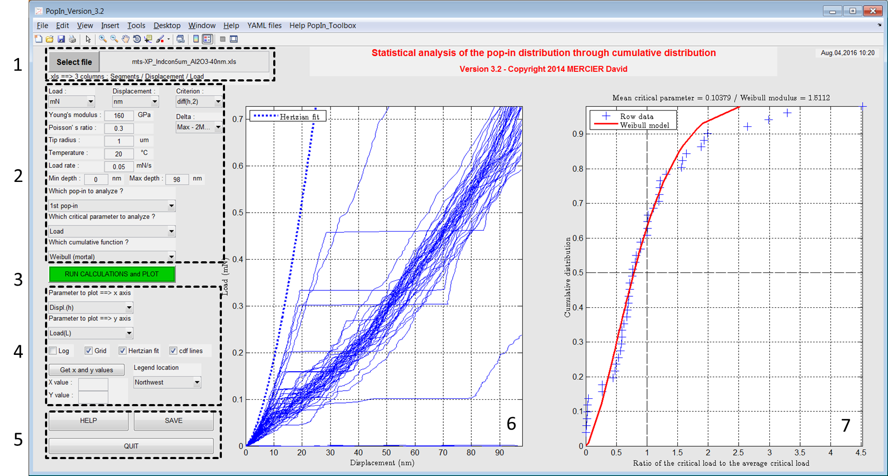

Overview of the toolbox
========================

.. include:: includes.rst

* 1) Import your (nano)indentation results. See here an `example file <http://popin.readthedocs.org/en/latest/examples.html>`_.

* 2) Set units, set the criterion of pop-in detection, set temperature of experiments, set the minimum and maximum indentation depths, set the pop-in to analyze and select the critical parameter to use for the Weibull distribution.

* 3) Run the calculations and plot results.

* 4) Set the plots.

* 5) Save a picture of the main interface or quit this interface.

* 6) Load-displacement curves with pop-in and Hertzian fit.

* 7) Cumulative distribution of the pop-in.

..  note::
    It is possible to modify YAML configuration files directly from the menu of this interface.
    
..  note::
    Documentation is reachable from the button 'HELP' or the menu.
